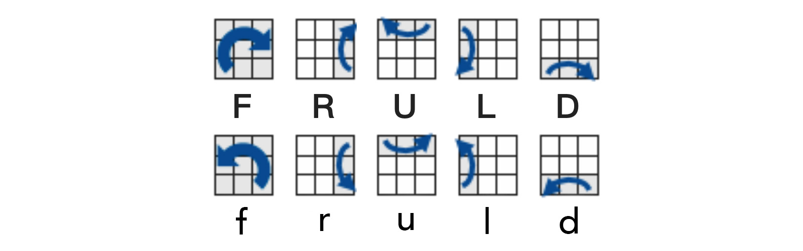

# Just a Cube

A rubik's cube solver.

&nbsp;

## Preview

https://renovamen.github.io/Just-a-Cube/index.html

&nbsp;

## Structure

```
├── cube
│   └── js
│       ├── lbl.js                  # Layer by layer algorithm
│       ├── two-phase.js            # Two-phase algorithm
│       ├── util.js                 # type, shuffle and reset
│       └── initial.js              # Initial a cube
└── lib
    ├── cubejs                      # Two-phase algorithm
    └── cuber                       # Rubik's cube simulator
```

&nbsp;

## About Cube

The cube simulator is from [Cuber](https://github.com/marklundin/cube).

### Face and Slice

                                               Back(B)
                                             -----------
                                           /   Up(U)   /|
                                          /     1     / |
                                          -----------  Right(R)
                                         |           |  |
                                 Left(L) |  Front(F) |  .
                                         |           | /
                                         |           |/
                                          -----------
                                            Down(D)

Standing(S): Rotate according to Front Face's orientation

Middle(M): Rotate according to Left Face's orientation

Equator(E): Rotate according to Up Face's orientation


### Default Color

- Front: Blue
- Back: Green
- Left: Orange
- Right: Red
- Up: Yellow
- Down: White


### Twist

A **capital** letter by each face itself means a **clockwise** rotation of the face while a **counterclockwise** turn is marked by a **small** letter.

For example:

U: A quarter clockwise turn on the Up face (90°).

u: A quarter counterclockwise turn on the Up face (-90°).




&nbsp;

## Algorithm

### Layer By Layer (层先法)

- [x] The First Layer Edges | 底部棱块归位
- [x] The First Layer Corners | 底部角块归位
- [ ] The Second Layer | 复原第二层
- [ ] The Top Cross | 顶部十字
- [ ] The Third Layer Corners (Position) | 顶部角块归位（位置）
- [ ] The Third Layer Corners (Orient) | 顶部角块归位（方向）
- [ ] The Third Layer Edges |  顶部棱块归位


### Two-Phase Algorithm

The JavaScript implentation of [Herbert Kociemba's two-phase algorithm](http://kociemba.org/cube.htm) is from [cube.js](https://github.com/ldez/cubejs).


### CFOP
